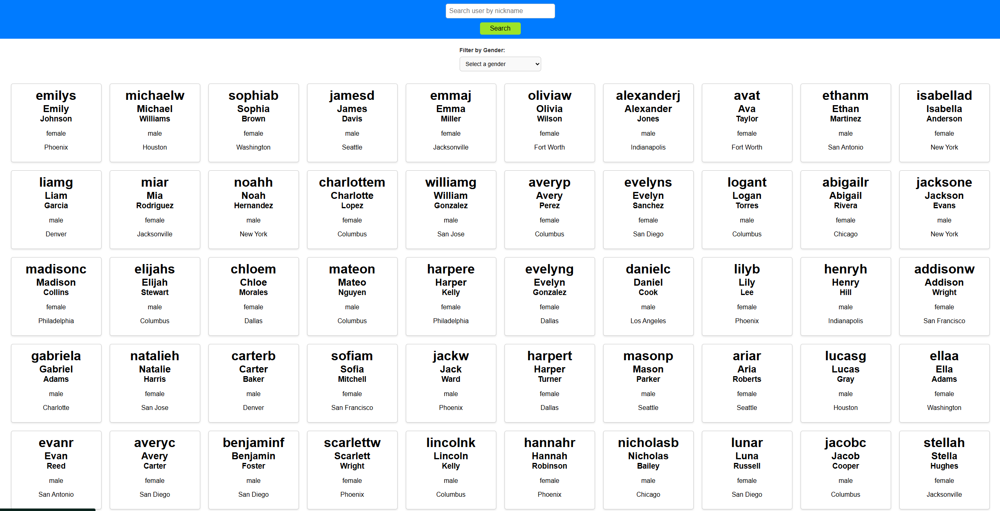

# 🧑‍💼 User Manager

User Manager — это современное кросс-платформенное приложение на **React + Vite**, которое позволяет:

- 🔍 Искать пользователей по имени или другим параметрам
- 🏙️ Фильтровать пользователей по полу (gender)
- ♾️ Загружать пользователей бесконечной прокруткой (infinite scroll)
- 📦 Использовать модальные окна для отображения информации об отсутствии результатов
- ⚡ Высокая производительность благодаря Vite, React Query и Code Splitting

---

## 🚀 Стек технологий

- **React** — библиотека для построения пользовательских интерфейсов
- **Vite** — современный сборщик с мгновенным HMR
- **TypeScript** — типизация для безопасности и предсказуемости
- **React Query** — работа с асинхронными запросами и кешем
- **SCSS** — стилизация компонентов
- **React Router** — навигация между страницами
- **Custom Hooks** — собственные хуки (observer, useInfiniteUsers)
- **React Modal** — удобная работа с модальными окнами

---

## 📷 Скриншоты



---

## 🛠 Установка и запуск проекта локально

```bash
# Клонируй репозиторий
git clone https://github.com/prom1r/user-manager.git
cd user-manager

# Установи зависимости
npm install

# Запусти проект в режиме разработки
npm run dev

# Сборка проекта для продакшена
npm run build

---

## 📁 Структура проекта

```

```plaintext
src/
├── api/                  # API-запросы (fetchUsers, searchUser)
├── components/           # UI компоненты (Search, Filter, UserCard, Modal)
├── hooks/                # Кастомные хуки (useObserver, useInfiniteUsers)
├── pages/                # Основные страницы
├── routes/               # Маршруты для роутера
├── styles/               # Общие SCSS стили
├── types/                # Типы TypeScript
└── App.tsx               # Точка входа

---

## ✍️ Автор

Разработано с ❤️ фронтенд-разработчиком

> [@prom1r](https://github.com/prom1r)

```
